# QT Py M0 iBUS Baby Chopper Controller

This project implements a FlySky iBUS receiver for controlling a 3D printed Baby Chopper droid (Mr. Baddeley design) using the Adafruit QT Py M0. The controller manages servo movement and head rotation with LED feedback for switch positions.

## Project Overview

This code controls a **3D printed Baby Chopper droid** with:
- **Servos 1 & 2**: Differential drive system (tank steering)
- **Servo 3**: Head rotation/spinning
- **LED Feedback**: Visual indication of switch positions
- **Future Features**: DFPlayer Pro for sound effects and animations

## Hardware Requirements

### Current Setup:
- **Adafruit QT Py M0** (CircuitPython controller)
- **FlySky transmitter** (e.g., FS-i6, FS-i6X) 
- **FlySky FS-A8S receiver** (iBUS output) - *other FS receivers should work too*
- **3x Continuous rotation servos** (for differential drive + head rotation)
- **Connecting wires**

### Future Additions:
- **DFPlayer Pro** (sound effects module)
- **Speaker** (for droid sounds)
- **POT Channel**: Volume control for audio levels

## Wiring

### QT Py M0 Connections:
- **A7 (RX)**: Connect to receiver iBUS signal output
- **A2**: Servo 1 signal wire (differential drive)
- **A3**: Servo 2 signal wire (differential drive)  
- **SDA**: Servo 3 signal wire (head rotation)
- **3V**: Receiver power (if using 3.3V receiver)
- **GND**: Common ground
- **Built-in NeoPixel**: Switch position feedback

### FlySky FS-A8S Receiver:
- **iBUS/Sensor port**: Connect signal wire to QT Py A7
- **Power**: Connect to appropriate power source (3.3V or 5V)
- **Ground**: Connect to QT Py GND

## Current Implementation

### Active Files:
- **`code.py`**: Main controller with inline iBUS parsing
  - Elegant, refactored design with helper functions
  - Direct servo control (channels 1, 2, 4)
  - Switch monitoring with LED feedback (channels 5, 6, 8)
  - Configuration-driven approach for easy customization

### Inactive Files (For Reference):
- **`lib/ibus.py`**: Minimal placeholder library
- **`lib/servo_controller.py`**: Minimal placeholder library  
- **`code_*.py`**: Alternative implementations (not currently used)

*Note: We learned that CircuitPython on QT Py M0 works best with simpler, inline approaches rather than complex library structures.*

## Control Mapping

### Servo Channels:
- **Channel 1**: Servo 1 (A2) - Differential drive motor 1
- **Channel 2**: Servo 2 (A3) - Differential drive motor 2  
- **Channel 4**: Servo 3 (SDA) - Head rotation

### Switch Channels:
- **Channel 5**: 2-position switch - Sound effects and animations (currently LED feedback)
- **Channel 6**: 2-position switch - Sound effects and animations (currently LED feedback)
- **Channel 8**: 3-position switch - Sound effects and animations (currently LED feedback)

### Future Planned:
- **POT Channel**: Volume control for DFPlayer Pro
- **Switch Sound Effects**: Channels 5, 6, 8 trigger droid sounds
- **Switch Animations**: Coordinated movement sequences with sounds

## System Architecture

### Data Flow Overview


### iBUS Frame Processing Sequence


### Switch State Machine


### iBUS Frame Structure


### Servo Control Flow

```mermaid
flowchart TD
    A[Raw iBUS Value 800-2200] --> B{Valid Range?}
    B -->|No| C[Use Default 1500]
    B -->|Yes| D[Normalize to -1.0 to 1.0]
    D --> E{Within Deadband ±0.02?}
    E -->|Yes| F[Set Throttle = 0]
    E -->|No| G[Set Servo Throttle]
    C --> F
    F --> H[Servo Motor]
    G --> H
    
    style A fill:#e1f5fe
    style H fill:#c8e6c9
    style F fill:#ffecb3
    style G fill:#ffecb3
```


## Code Structure

The current implementation uses a **clean, inline approach** in `code.py` with these key features:

### Configuration-Driven Design:
```python
CONFIG = {
    'servo_channels': [1, 2, 4],      # iBUS channels for servos
    'servo_byte_pos': [2, 4, 8],     # Byte positions in iBUS frame
    'switch_channels': [5, 6, 8],    # iBUS channels for switches
    'switch_colors': [
        [colors['purple'], colors['orange']],              # Switch 1: 2-position
        [colors['cyan'], colors['blue']],                  # Switch 2: 2-position  
        [colors['magenta'], colors['cyan'], colors['yellow']] # Switch 3: 3-position
    ],
    'deadband': 0.02,
    'switch_3pos_thresholds': [1300, 1700]
}
```

### Helper Functions:
- **`extract_channel_value()`**: Get raw values from iBUS frame
- **`normalize_servo_value()`**: Convert to servo throttle with deadband
- **`get_switch_position()`**: Handle 2 and 3-position switches
- **`show_switch_color()`**: LED feedback system
- **`update_servos()`**: Process all servos in loop
- **`update_switches()`**: Handle switch monitoring
- **`parse_ibus_frame()`**: Main frame processing

### Main Loop:
```python
while True:
    data = uart.read(32)
    if data:
        parse_ibus_frame(data)
    controller.update()  # Compatibility placeholder
    time.sleep(0.05)  # 20Hz updates
```

## LED Status Indicators

The built-in NeoPixel currently provides feedback for switch positions *(will be replaced with sound effects and animations)*:

### Switch 1 (Channel 5) - 2 Position:
- **Purple**: Position 0 (Low) - *Future: Sound effect trigger*
- **Orange**: Position 1 (High) - *Future: Different sound effect*

### Switch 2 (Channel 6) - 2 Position:  
- **Cyan**: Position 0 (Low) - *Future: Animation trigger*
- **Blue**: Position 1 (High) - *Future: Different animation*

### Switch 3 (Channel 8) - 3 Position:
- **Magenta**: Position 0 (Low) - *Future: Animation mode 1*
- **Cyan**: Position 1 (Middle) - *Future: Animation mode 2*
- **Yellow**: Position 2 (High) - *Future: Animation mode 3*

### Startup:
- **White**: System starting up

## Baby Chopper Droid Control

### Tank Steering System:
The Baby Chopper uses **differential drive** (tank steering) where channels 1 and 2 are mixed to create:

#### Forward/Backward Movement:
- **Both motors same direction**: Droid moves forward or backward
- **Channel 1 & 2 receive same throttle values**

#### Rotational Movement:
- **Motors opposite directions**: Droid spins in place
- **Right turn**: Channel 1 forward + Channel 2 reverse → Clockwise spin
- **Left turn**: Channel 1 reverse + Channel 2 forward → Counter-clockwise spin

#### Mixed Movement:
- **Differential speeds**: Curved movement paths
- **One motor faster**: Droid curves toward slower motor side

### Movement Control:
- **Forward Stick**: Both drive motors forward (droid moves forward)
- **Backward Stick**: Both drive motors reverse (droid moves backward)
- **Right Stick**: Motors rotate opposite directions (droid spins clockwise)
- **Left Stick**: Motors rotate opposite directions (droid spins counter-clockwise)
- **Head Control**: Right stick vertical controls head rotation speed (channel 4)
- **Deadband**: 2% around center to prevent drift

### Switch Functions (Current):
- **Switches 1 & 2**: LED feedback only (will become sound effect triggers)
- **Switch 3**: LED feedback only (will become animation mode selection)

### Future Enhancements:
- **Sound Effects**: DFPlayer Pro integration with switch triggers
- **Animations**: Pre-programmed movement sequences triggered by switches
- **Volume Control**: POT channel for audio levels
- **LED Replacement**: Switch LED feedback replaced with sound/movement responses

## iBUS Protocol Implementation

- **Baud Rate**: 115200 bps
- **Frame Size**: 32 bytes  
- **Update Rate**: ~50Hz (20ms)
- **Channels**: 14 channels, 16-bit each
- **Range**: Typically 1000-2000 microseconds

### Frame Format:
```
[0x20] [0x40] [Ch1_L] [Ch1_H] [Ch2_L] [Ch2_H] ... [Ch14_L] [Ch14_H] [CRC_L] [CRC_H]
```

### Channel Data Extraction:
```python
def extract_channel_value(data, byte_pos):
    """Extract 16-bit channel value from iBUS data"""
    if len(data) > byte_pos + 1:
        return (data[byte_pos + 1] << 8) | data[byte_pos]
    return 1500
```

## Usage Example

### Basic Setup:
```python
# Create servos for Baby Chopper
servos = [
    servo.ContinuousServo(pwmio.PWMOut(board.A2, frequency=50)),  # Drive motor 1
    servo.ContinuousServo(pwmio.PWMOut(board.A3, frequency=50)),  # Drive motor 2  
    servo.ContinuousServo(pwmio.PWMOut(board.SDA, frequency=50))  # Head rotation
]

# Main control loop
while True:
    data = uart.read(32)
    if data:
        parse_ibus_frame(data)  # Updates servos and switches
    time.sleep(0.05)  # 20Hz updates
```

### Servo Control:
```python
def normalize_servo_value(raw_value):
    """Convert raw iBUS value to servo throttle (-1.0 to 1.0)"""
    if not (800 <= raw_value <= 2200):
        return 0.0
    throttle = (raw_value - 1500) / 500.0
    return 0.0 if abs(throttle) < CONFIG['deadband'] else throttle
```

## Troubleshooting

### No Connection:
1. Check wiring between FS-A8S receiver and QT Py A7
2. Verify receiver is bound to transmitter
3. Ensure receiver is powered  
4. Check baud rate (should be 115200)
5. Look for white LED startup indication

### Servos Not Responding:
1. Verify servos are connected to A2, A3, SDA
2. Check servo power requirements
3. Ensure channels 1, 2, 4 are active on transmitter
4. Check for LED feedback when moving switches

### Switch LED Not Working:
1. Move switches on channels 5, 6, 8
2. Verify transmitter switch assignments
3. Check for 1-second color display followed by LED off
4. Ensure magenta color is now defined in colors dictionary

## Development Notes

### Why Inline Implementation?
We discovered that CircuitPython on QT Py M0 works best with simpler approaches:
- **Complex libraries cause import crashes** and yellow error blinks
- **Inline code is more reliable** and easier to debug
- **Memory constraints** favor monolithic design
- **Direct hardware access** provides better performance

### Pin Selection:
- **A0, A1**: Cannot do PWM (used A2, A3, SDA instead)
- **A7**: RX pin for iBUS data
- **TX**: Reserved for future DFPlayer Pro communication

## Future Roadmap

### Phase 1 (Current):
- ✅ Basic servo control
- ✅ Switch monitoring with LED feedback
- ✅ Elegant inline code structure

### Phase 2 (Planned):
- 🔄 DFPlayer Pro integration  
- 🔄 POT volume control
- 🔄 Replace LED feedback with sound effects
- 🔄 Switch-triggered animations

### Phase 3 (Future):
- 📋 Pre-programmed movement animations
- 📋 Coordinated movement + sound sequences
- 📋 Baby Chopper personality behaviors

## License

MIT License - See individual file headers for details.